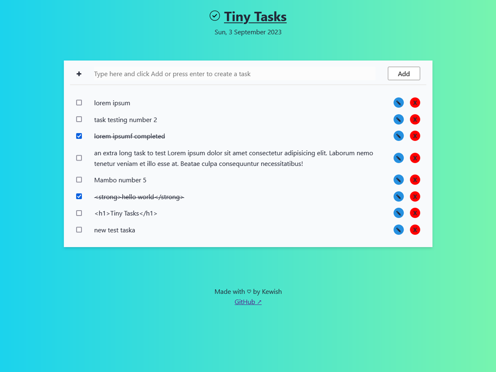

<p align="center"></p>

# Tiny Tasks

A tasks list side project to learn how localStorage works in browsers. 




## Run Locally

Clone the project

```bash
git clone https://github.com/kewishfagoe/tiny-tasks.git tiny-tasks
```

Navigate to the project source directory

```bash
cd ./tiny-tasks/src/
```

Open the index.html file directly in your browser or serve it with a local server.

```bash
start ./index.html
```

Install NPM dependencies to build project

```bash
npm ci
```

Build project

```bash
npm run build
```

## Tech Stack

- HTML & CSS
- JavaScript

## Acknowledgements

- [Check icon used](https://www.reshot.com/free-svg-icons/item/check-SKUA2PMXWE/)
- [Check favicon used](https://www.reshot.com/free-svg-icons/item/check-all-74WFCQUGE2/)

## License

[MIT](/LICENSE)